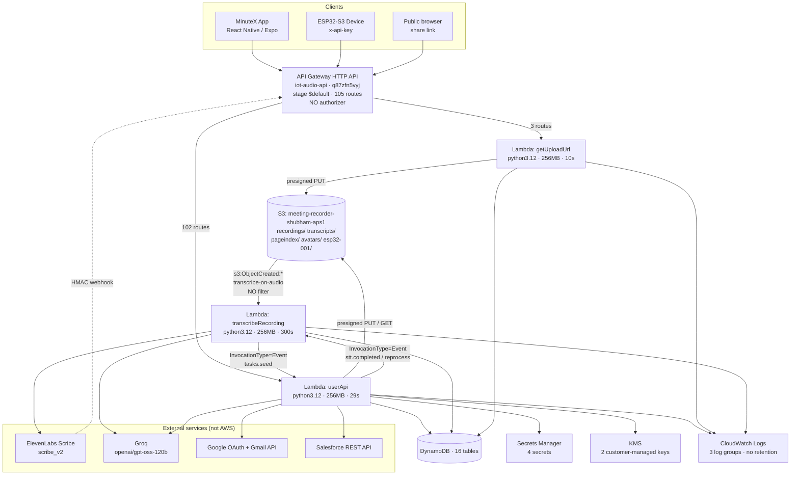
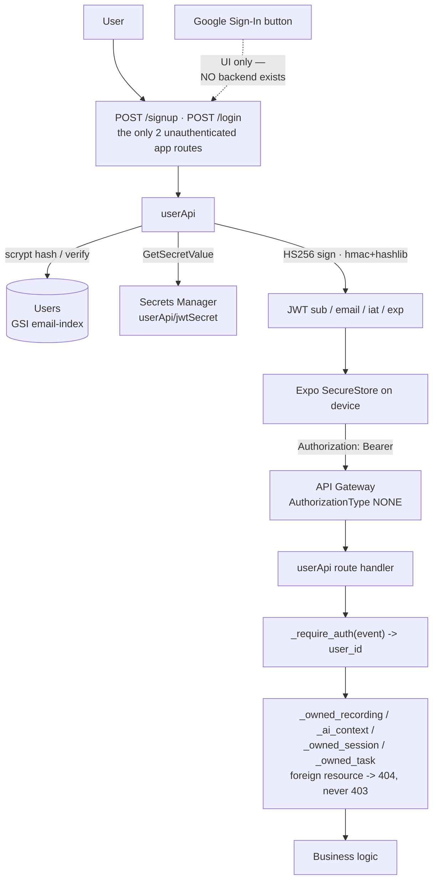
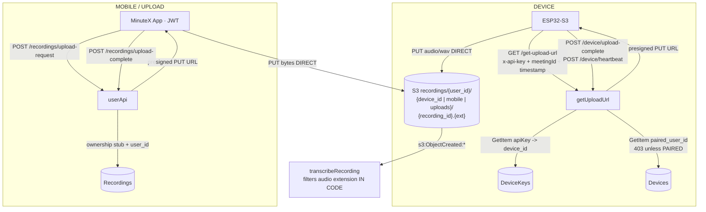
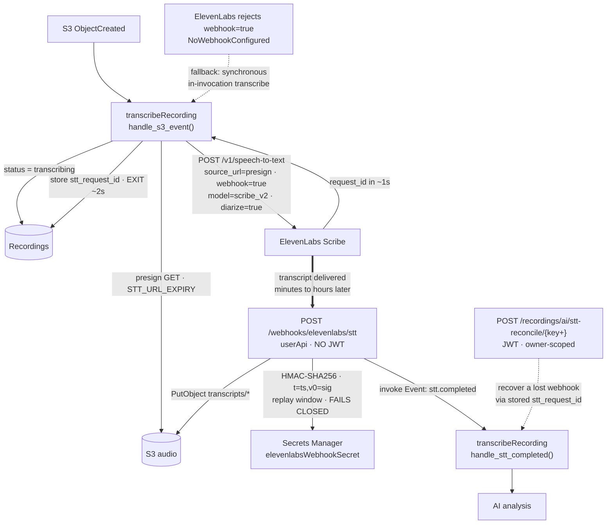
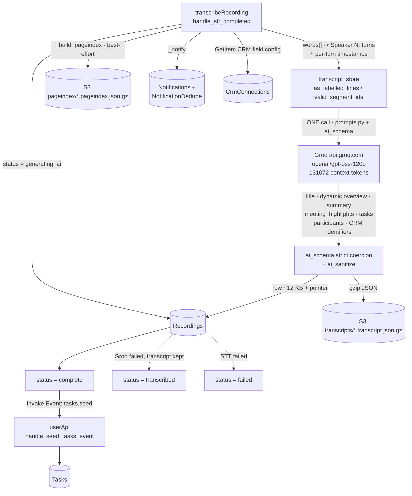
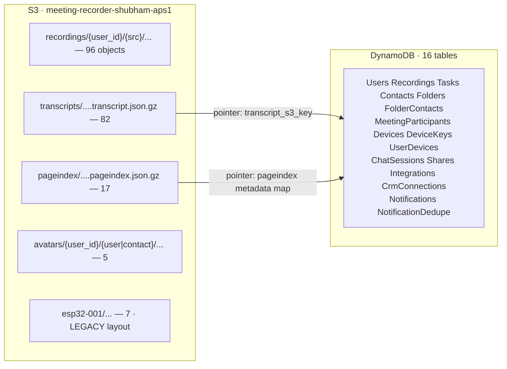

# MinuteX — AWS Architecture

> **Architecture capture.** This document and the accompanying `template.yaml`
> describe the **existing, manually deployed** MinuteX AWS environment. They were
> produced entirely from **read-only** AWS API calls plus source inspection.
>
> **`template.yaml` has NOT been deployed and no AWS resources were created,
> modified, or deleted to produce it.**

| | |
|---|---|
| **AWS account** | `624734879550` |
| **Region** | `ap-south-1` (single region) |
| **Captured** | 2026-09-03 |
| **Captured by** | read-only AWS CLI `describe`/`get`/`list` calls |
| **IaC status before capture** | none — no CloudFormation, SAM, Terraform, CDK or Serverless Framework existed |
| **Deployment mechanism** | 49 hand-run numbered bash scripts in `cloud/scripts/` |

---

## 1. Current infrastructure

```text
Account: 624734879550
Region:  ap-south-1
```

### Resource counts

| Resource | Count | Verified |
|---|---|---|
| API Gateway (HTTP API v2) | **1** | ✅ Confirmed from AWS |
| API Gateway (REST API v1) | 0 | ✅ Confirmed from AWS |
| Lambda functions | **3** | ✅ Confirmed from AWS |
| Lambda layers | 0 | ✅ Confirmed from AWS |
| DynamoDB tables | **16** | ✅ Confirmed from AWS |
| S3 buckets | **1** | ✅ Confirmed from AWS |
| Secrets Manager secrets | **4** | ✅ Confirmed from AWS |
| KMS customer-managed keys | **2** (+2 aliases) | ✅ Confirmed from AWS |
| IAM Lambda execution roles | **3** | ✅ Confirmed from AWS |
| CloudWatch log groups | **3** | ✅ Confirmed from AWS |
| CloudWatch alarms / dashboards | 0 / 0 | ✅ Confirmed from AWS |

### Services verified ABSENT from the account

Cognito · SQS · SNS · EventBridge (rules *and* scheduler) · Step Functions ·
RDS · ElastiCache · CloudFront · Route 53 · ECS · ECR · SSM Parameter Store ·
AWS Transcribe · Bedrock · IoT Core · DynamoDB Streams · CloudFormation stacks ·
GitHub Actions workflows.

SES exists at the account level but is **in sandbox with 0 verified identities
and 0 messages sent** — all email goes out through the Gmail API instead.

A default VPC (`vpc-0d9eaa400b12572d5`) exists, but **no Lambda is
VPC-attached**.

---

## 2. Main architecture

```text
MinuteX App (React Native / Expo)  ·  ESP32-S3 device  ·  public share browser
        |
        v
API Gateway HTTP API  iot-audio-api (q87zfn5vyj), stage $default
        |                                    105 routes, ALL AuthorizationType NONE
        +---- 3 routes ----> getUploadUrl    (x-api-key, device only)
        +-- 102 routes ----> userApi         (JWT verified inside the Lambda)
        |
        v
S3  meeting-recorder-shubham-aps1   <-- clients PUT/GET directly via presigned URLs
        |
        | s3:ObjectCreated:*  (no prefix/suffix filter)
        v
transcribeRecording
        |
        +--> ElevenLabs Scribe   (async job start; returns a request_id in ~1s)
        |         |
        |         +-- webhook --> userApi  POST /webhooks/elevenlabs/stt  (HMAC-SHA256)
        |                              |
        |                              +-- async invoke --> transcribeRecording
        |                                                     (type: stt.completed)
        v
Groq  openai/gpt-oss-120b   (one call: title, overview, summary, highlights,
        |                    tasks, participants, CRM identifiers)
        v
DynamoDB (16 tables)  +  S3 (transcripts/, pageindex/)
        |
        +-- async invoke --> userApi (type: tasks.seed) --> Tasks table
        |
        v
AI Chat / PageIndex retrieval / Documents / MoM / Salesforce sync / Gmail send
```

---

## 3. Architecture diagrams

### 3.1 System overview



### 3.2 Authentication



### 3.3 Recording / upload — three sources, one pipeline



No Lambda ever handles audio bytes — every transfer is client ↔ S3 by presigned URL.

### 3.4 Transcription — asynchronous, webhook-completed



### 3.5 AI processing



### 3.6 AI chat — per-meeting (PageIndex RAG) and workspace-wide

```mermaid
flowchart TD
    subgraph PerMeeting["Per-meeting chat"]
      A1["POST /recordings/ai/chat/{key+}"] --> OW["_owned_recording<br/>404 if not owner"]
      OW --> FIT{"transcript fits<br/>AI_CONTEXT_MAX_CHARS?"}
      FIT -->|yes| WHOLE["send whole transcript"]
      FIT -->|no| PI["PageIndex retrieval"]
      PI --> LOAD["pageindex_store: fresh?<br/>keyed on transcript_fingerprint"]
      LOAD -->|"stale / absent"| CLAIM["conditional-write claim<br/>single-flight -> build -> S3"]
      LOAD -->|fresh| S3P[("S3 pageindex/*.gz")]
      CLAIM --> S3P
      S3P --> NAV["Groq nav call<br/>ToC -> node_ids · json_mode · temp 0"]
      NAV --> SEG["segments_for_nodes -> render"]
      SEG --> ANS
      WHOLE --> ANS["Groq answer call<br/>+ authoritative MoM override"]
      ANS --> SAN["ai_sanitize · strips seg_* ids"]
      SAN --> HIST["chat_history on Recordings row<br/>trimmed to MAX_CHAT_TURNS"]
    end

    subgraph Workspace["Workspace assistant"]
      A2["POST /ai/chat"] --> AC["_ai_context<br/>user_id from JWT ONLY;<br/>body user_id ignored"]
      AC --> SESS["_owned_session -> ChatSessions<br/>PK session_id · GSI user-index"]
      SESS --> TOOLS["agentic tool loop<br/>AI_MAX_TOOL_HOPS · AI_TOOL_ROW_LIMIT"]
      TOOLS --> QT[("Tasks · Contacts · Folders<br/>Recordings via GSIs")]
      TOOLS --> GQ2["Groq"]
      GQ2 --> TURNS["turns[] on ChatSessions item<br/>MAX_SESSION_TURNS=40<br/>~123 KB worst case"]
    end
```



### 3.7 Data storage



S3: SSE-S3 (AES256, bucket key on) · all 4 public-access blocks ON ·
`BucketOwnerEnforced` · **no versioning, no lifecycle, no CORS, no bucket policy**.

DynamoDB: all `PAY_PER_REQUEST` · no streams · **PITR disabled on all 16** ·
**deletion protection disabled on all 16** · TTL only on `NotificationDedupe`.

---

## 4. Lambda dependency map

| Lambda | Trigger | Calls | Reads | Writes | IAM role |
|---|---|---|---|---|---|
| `userApi`<br/>py3.12 · 256 MB · **29 s** · x86_64<br/>53 env vars | ✅ API GW (102 routes)<br/>🔎 async invoke from `transcribeRecording` (`tasks.seed`) | ✅ `lambda:InvokeFunction` → `transcribeRecording`<br/>🔎 Groq · Google OAuth + Gmail · Salesforce REST · ElevenLabs (reconcile) | 15 tables + their indexes; S3 `GetObject` on `*`; 4 secrets | Recordings, Users, UserDevices, Devices, Contacts, Folders, FolderContacts, MeetingParticipants, Tasks, ChatSessions, Shares, Integrations, CrmConnections, Notifications, NotificationDedupe; S3 `avatars/*` `transcripts/*` `pageindex/*`, presign `recordings/*`; KMS Encrypt/Decrypt ×2 | `userApi-aps1` |
| `getUploadUrl`<br/>py3.12 · 256 MB · **10 s** · x86_64<br/>4 env vars | ✅ API GW (3 routes: `/get-upload-url`, `/device/heartbeat`, `/device/upload-complete`) | — no outbound calls | DeviceKeys, Devices | Devices (`last_seen`, `firmware_version`); S3 `PutObject` on **whole bucket** | `getUploadUrl-aps1` |
| `transcribeRecording`<br/>py3.12 · 256 MB · **300 s** · x86_64<br/>19 env vars | ✅ S3 `ObjectCreated:*` (`transcribe-on-audio`, no filter)<br/>🔎 async invoke from `userApi` (`stt.completed`) | ✅ `lambda:InvokeFunction` → `userApi`<br/>🔎 ElevenLabs Scribe · Groq | S3 `GetObject` on `*`; Recordings, CrmConnections, Notifications | Recordings; S3 `transcripts/*` `pageindex/*`; Notifications, NotificationDedupe | `transcribeRecording-aps1` |

**Not configured on any function** ❌: layers · DLQ · event-invoke destinations ·
reserved concurrency · provisioned concurrency · VPC · X-Ray (all `PassThrough`) ·
SnapStart · Function URLs · event source mappings · tags.
Ephemeral storage is the 512 MB default on all three.

### Lambda → Lambda invocation

All four cross-Lambda call sites use **`InvocationType="Event"` (asynchronous)** — 🔎 confirmed from source:

| Direction | Payload | Source location |
|---|---|---|
| `userApi` → `transcribeRecording` | S3-shaped reprocess event | `cloud/functions/userapi/lambda_function.py:2983` |
| `userApi` → `transcribeRecording` | `stt.completed` (webhook path) | `cloud/functions/userapi/lambda_function.py:9851` |
| `userApi` → `transcribeRecording` | `stt.completed` (reconcile path) | `cloud/functions/userapi/lambda_function.py:10054` |
| `transcribeRecording` → `userApi` | `tasks.seed` | `cloud/functions/transcribe/lambda_function.py:1348` |

Authorized by the **caller's IAM role** (`userApi-invoke-transcribe`,
`transcribe-invoke-userapi`) — no Lambda resource policy statement exists for
these, which is correct and sufficient for same-account invocation.

---

## 5. API Gateway → Lambda mapping

✅ Confirmed from AWS.

```text
iot-audio-api  (HTTP API v2, id q87zfn5vyj)
  stage: $default          AutoDeploy: true    no access logging
  authorizers: 0           CORS: not configured
  route settings: none     DetailedMetricsEnabled: false
  |
  +-- 102 routes --> integration iaj7p5d --> arn:...:function:userApi
  +--   3 routes --> integration 35ed8e8 --> arn:...:function:getUploadUrl
  |
  Total: 105 routes.  ALL of them: AuthorizationType=NONE, ApiKeyRequired=false.
  Both integrations: AWS_PROXY, payload format 2.0, timeout 30000 ms.
```

### The 3 device routes → `getUploadUrl`

```text
GET  /get-upload-url
POST /device/heartbeat
POST /device/upload-complete
```

### Authorization reality for the 102 `userApi` routes

🔎 Confirmed from source, by transitively resolving every handler through the
auth helpers (`_require_auth`, `_owned_recording`, `_ai_context`,
`_owned_session`, `_owned_task`, `_owned_contact`, `_owned_folder`,
`_owned_notification`):

| | Count |
|---|---|
| Routes enforcing a JWT | **97** |
| Routes intentionally unauthenticated | **5** |

The 5 unauthenticated routes, each deliberate:

| Route | Why |
|---|---|
| `POST /signup` | account creation |
| `POST /login` | credential exchange |
| `GET /crm/salesforce/callback` | Salesforce browser redirect carries no JWT; verified via signed `state` |
| `GET /integrations/{provider}/callback` | same, for Gmail |
| `GET /share/{token}/audio` | authorizes on the share token, then 302s to a fresh short-lived presign |

Two further routes carry no JWT but are **not** unauthenticated — they use a
different credential:

| Route | Credential |
|---|---|
| `GET /share/{token}` | the share token itself (stored only as sha256) |
| `POST /webhooks/elevenlabs/stt` | HMAC-SHA256 over the raw body, replay window, fails closed |

---

## 6. S3 → Lambda mapping

✅ Confirmed from AWS.

```text
Bucket:  meeting-recorder-shubham-aps1   (ap-south-1)
  Notification id:   transcribe-on-audio
  Event:             s3:ObjectCreated:*
  Destination:       arn:aws:lambda:ap-south-1:624734879550:function:transcribeRecording
  Prefix filter:     NONE
  Suffix filter:     NONE

Lambda resource policy on transcribeRecording:
  Sid:            s3-invoke-transcribe
  Principal:      s3.amazonaws.com
  Action:         lambda:InvokeFunction
  SourceAccount:  624734879550
  SourceArn:      arn:aws:s3:::meeting-recorder-shubham-aps1
```

Because there is **no filter**, every `ObjectCreated` event on this bucket —
including avatar, transcript and PageIndex writes — invokes
`transcribeRecording`, which then discards non-audio keys in code
(`AUDIO_EXTS` check). The only thing preventing a trigger loop is the code
convention that the function never writes a `.wav`-suffixed key. 🔎

---

## 7. Storage detail

### 7.1 DynamoDB — 16 tables

Common to all 16 ✅: `PAY_PER_REQUEST` · no streams · no LSIs · no tags ·
PITR **disabled** · deletion protection **disabled** · no `SSEDescription`
(so: AWS-owned default encryption key, not a CMK). Every GSI projects `ALL`.

| Table | Purpose | PK | SK | GSIs | Items | TTL |
|---|---|---|---|---|---|---|
| `Users` | Accounts; scrypt password hash | `user_id` | — | `email-index` | 42 | — |
| `Recordings` | Meeting rows; S3 pointers for transcript + PageIndex | `audio_s3_key` | — | `user-index`, `device-index` | 121 | — |
| `Tasks` | AI + manual tasks | `task_id` | — | `owner-index`, `assignee-index`, `assignee-user-index`, `folder-index`, `meeting-index`, `dedupe-index` | 80 | — |
| `Contacts` | Per-user contacts | `contact_id` | — | `owner-index`, `owner-email-index`, `owner-phone-index` | 14 | — |
| `Folders` | Projects / folders | `folder_id` | — | `owner-index` | 22 | — |
| `FolderContacts` | Folder ↔ contact edge | `folder_id` | `contact_id` | `contact-index` | 7 | — |
| `MeetingParticipants` | Speaker → contact mapping | `audio_s3_key` | `speaker_id` | `contact-index` | 20 | — |
| `Devices` | Device **ownership** + pairing state | `device_id` | — | `paired-user-index` | 1 | — |
| `DeviceKeys` | Device **authentication** only | `apiKey` | — | — | 1 | — |
| `UserDevices` | LEGACY claim link | `user_id` | `device_id` | — | 5 | — |
| `ChatSessions` | Workspace conversations; bounded `turns[]` | `session_id` | — | `user-index` | 1 | — |
| `Shares` | Public links; sha256 of token only | `share_id` | — | `token-index`, `recording-index` | 9 | — |
| `Integrations` | Gmail OAuth tokens (KMS-encrypted) | `user_id` | `provider` | — | 3 | — |
| `CrmConnections` | Salesforce tokens + mappings (KMS-encrypted) | `user_id` | `provider` | — | 1 | — |
| `Notifications` | Notification centre | `notification_id` | — | `user-index`, `user-unread-index` | 51 | — |
| `NotificationDedupe` | Idempotency claims | `dedupe_key` | — | — | 54 | ✅ `expires_at` |

### 7.2 S3 — the single bucket

| Property | Deployed value |
|---|---|
| Name / region | `meeting-recorder-shubham-aps1` / `ap-south-1` |
| Encryption | SSE-S3 `AES256`, `BucketKeyEnabled: true`, SSE-C blocked |
| Public access block | all four ON (`BlockPublicAcls`, `IgnorePublicAcls`, `BlockPublicPolicy`, `RestrictPublicBuckets`) |
| Bucket policy | none (`NoSuchBucketPolicy`) |
| Object ownership | `BucketOwnerEnforced` |
| ACL | owner `FULL_CONTROL` only |
| Versioning | **not enabled** |
| Lifecycle | **none** |
| CORS | **none** |
| Tags | none |
| Notification | `s3:ObjectCreated:*` → `transcribeRecording`, no filters |

Prefixes: `recordings/` (96) · `transcripts/` (82) · `pageindex/` (17) ·
`avatars/` (5) · `esp32-001/` (7, legacy pre-user-ownership layout).

---

## 8. IAM map

| Role | Used by | Managed policies | Inline policies | Statements |
|---|---|---|---|---|
| `userApi-aps1` | `userApi` | **none** | 13 | 28 |
| `getUploadUrl-aps1` | `getUploadUrl` | `AWSLambdaBasicExecutionRole` | 3 | 9 |
| `transcribeRecording-aps1` | `transcribeRecording` | `AWSLambdaBasicExecutionRole` | 5 | 8 |

All three trust only `lambda.amazonaws.com`; `MaxSessionDuration` 3600; no
permissions boundary. Every policy is reproduced verbatim in `template.yaml`.

### Assessment (reported, not changed)

This is **better-than-typical least privilege**: no wildcard service actions
(`dynamodb:*`, `s3:*`), no `Resource: "*"` on data actions, every table and
secret named individually, S3 writes split by prefix.

Three grants are broader than necessary. **All preserved as-is** in the
template with `# Existing deployed permission. Not changed during architecture
capture.`:

1. ⚠️ `getUploadUrl-aps1` carries **three overlapping inline policies**
   (`device-presign-inline`, `get-upload-url-access`, `getUploadUrl-inline`)
   that each grant `s3:PutObject` on `…/*` — the whole bucket, not
   `recordings/*`. Since a presigned URL inherits the signer's permissions, a
   path-traversal bug in the key builder could sign a PUT over `transcripts/`,
   `pageindex/` or `avatars/`. Mitigated in code by a strict allow-list regex
   on `meetingId`/`timestamp` 🔎, so this is defence-in-depth, not a live hole.
   The redundancy is deploy-script accretion.
2. ⚠️ `userApi-aps1` and `transcribeRecording-aps1` hold `s3:GetObject` on
   `…/*` rather than only the four prefixes they read.
3. ⚠️ `logs:*` on `arn:aws:logs:ap-south-1:…:*` in the hand-written policies is
   broader than each function's own log group.

---

## 9. Secrets and KMS

### Secrets Manager — 4 secrets, all read by `userApi` only

| Name | Purpose | Rotation |
|---|---|---|
| `userApi/jwtSecret` | HS256 JWT signing key | not configured |
| `userApi/googleClientSecret` | Google OAuth client secret (Gmail) | not configured |
| `userApi/salesforceClientSecret` | Salesforce Connected App consumer secret | not configured |
| `userApi/elevenlabsWebhookSecret` | ElevenLabs STT webhook HMAC secret | not configured |

Read at runtime via `secretsmanager:GetSecretValue` using the `*_ARN`
environment variables — **not** via a `{{resolve:secretsmanager:...}}` template
reference. No secret value was read during capture and none appears in
`template.yaml`.

### KMS — 2 customer-managed symmetric keys

| Alias | Key id | State | Rotation |
|---|---|---|---|
| `alias/crm-salesforce` | `b5a78676-4c51-4ba4-8f2a-bb0a77bfcec4` | Enabled | **disabled** |
| `alias/minutex-integrations` | `33f5f31c-5c64-4826-9e64-588b70a12645` | Enabled | **disabled** |

Both `SYMMETRIC_DEFAULT` / `ENCRYPT_DECRYPT` / `CUSTOMER`-managed. Used at the
**application layer** by `userApi` to envelope-encrypt per-user OAuth refresh
tokens before writing them to DynamoDB.

⚠️ **Key policies were NOT read** (`kms:GetKeyPolicy` was not called). The
`KeyPolicy` in `template.yaml` is a minimal placeholder, explicitly annotated as
unverified. Re-read the real policies before any import.

---

## 10. CloudWatch

| Log group | Retention | KMS | Class | Stored |
|---|---|---|---|---|
| `/aws/lambda/userApi` | **never expires** | none | STANDARD | 2.19 MB |
| `/aws/lambda/transcribeRecording` | **never expires** | none | STANDARD | 318 KB |
| `/aws/lambda/getUploadUrl` | **never expires** | none | STANDARD | 21.6 KB |

Alarms: **0**. Dashboards: **0**. EventBridge rules: **0**.
`RetentionInDays` is deliberately omitted from the template — setting one would
be a change, not a capture.

---

## 11. External services

Not modelled as CloudFormation resources; documented in the template's header
comment and `Metadata.Capture.ExternalServices`.

| Service | Used by | Purpose | Credential source |
|---|---|---|---|
| **ElevenLabs Scribe**<br/>`api.elevenlabs.io/v1/speech-to-text` | `transcribeRecording` (start + sync fallback), `userApi` (reconcile) | STT + diarization; `scribe_v2`, `source_url` + `webhook=true`, auto language detect | ⚠️ `ELEVENLABS_API_KEY` — **plaintext Lambda env var** |
| **ElevenLabs webhook** (inbound) | → `userApi` `POST /webhooks/elevenlabs/stt` | async transcript delivery | ✅ Secrets Manager `userApi/elevenlabsWebhookSecret`, HMAC-SHA256, fails closed |
| **Groq**<br/>`api.groq.com/openai/v1/chat/completions` | `transcribeRecording` (staged analysis), `userApi` (documents, MoM, Quick AI, chat, PageIndex nav, task intelligence) | LLM; `GROQ_MODEL`, `GROQ_CONTEXT_TOKENS`, `GROQ_TPM_LIMIT` | ⚠️ `GROQ_API_KEY` — **plaintext Lambda env var** |
| **Google OAuth**<br/>`accounts.google.com`, `oauth2.googleapis.com` | `userApi` | Gmail integration consent, token exchange/revoke. **NOT user login.** | ✅ `GOOGLE_CLIENT_ID` (env) + Secrets Manager `googleClientSecret`; refresh tokens KMS-encrypted |
| **Gmail API**<br/>`gmail.googleapis.com` | `userApi` | send meeting summaries / task emails | as above |
| **Salesforce**<br/>`login.salesforce.com` + instance REST | `userApi` | OAuth connect, object/field discovery, lookup, meeting sync | ✅ `SALESFORCE_CLIENT_ID` (env) + Secrets Manager `salesforceClientSecret`; refresh tokens KMS-encrypted |

❌ AWS Transcribe and Bedrock are **not** used — all STT and LLM work is external.

---

## 12. Verification status

| Resource | Status |
|---|---|
| HTTP API `iot-audio-api` (id, protocol, stage, autodeploy, 105 routes, integrations, 0 authorizers, no CORS, no throttle) | ✅ Confirmed from AWS |
| 3 Lambda functions (runtime, arch, memory, timeout, handler, role, env var **names**, no layers/VPC/DLQ/destinations/concurrency/URL, tracing, SnapStart, tags) | ✅ Confirmed from AWS |
| 16 DynamoDB tables (keys, attribute definitions, GSIs, billing, PITR, deletion protection, streams, TTL, SSE, tags) | ✅ Confirmed from AWS |
| S3 bucket (region, encryption, public access block, policy absence, ACL, ownership, versioning, lifecycle, CORS, notification, tags) | ✅ Confirmed from AWS |
| 3 IAM roles (trust policy, managed policies, all 21 inline policies, all 45 statements) | ✅ Confirmed from AWS |
| 4 Secrets Manager secrets (name, ARN, description, rotation) | ✅ Confirmed from AWS |
| 2 KMS keys (id, alias, state, spec, usage, manager, rotation status) | ✅ Confirmed from AWS |
| 3 CloudWatch log groups (name, retention, KMS, class) | ✅ Confirmed from AWS |
| Lambda resource policies (API GW + S3 invoke permissions) | ✅ Confirmed from AWS |
| S3 → Lambda trigger with **no** prefix/suffix filter | ✅ Confirmed from AWS |
| Absence of Cognito, SQS, SNS, EventBridge, Step Functions, RDS, ElastiCache, CloudFront, Route 53, ECS/ECR, SSM, IoT, CFN stacks | ✅ Confirmed from AWS |
| Lambda → Lambda invokes are asynchronous (`InvocationType=Event`, all 4 sites) | 🔎 Confirmed from source |
| Which of the 102 `userApi` routes enforce a JWT (97) vs. not (5) | 🔎 Confirmed from source |
| Audio never passes through a Lambda (presigned URLs only) | 🔎 Confirmed from source |
| Transcript / PageIndex offloaded to S3 with a DynamoDB pointer | 🔎 Confirmed from source + S3 objects |
| Google Sign-In has **no** backend (UI-only) | 🔎 Confirmed from source (0 `id_token` verifications; `login.tsx:310`) |
| Firmware pairing confirmation is mocked (`FirmwareVerifier`) | 🔎 Confirmed from source |
| STT webhook currently registered in the ElevenLabs workspace | ⚠️ Inferred — external state; the webhook secret was last accessed 2026-09-03, which suggests the async path is live |
| KMS **key policies** | ❌ Not retrieved — `kms:GetKeyPolicy` not called; template placeholder is explicitly unverified |
| DynamoDB on-demand **backups** / backup plans | ❌ Not retrieved (PITR *was* checked and is disabled on all 16) |
| Deployed zip contents vs. working tree | ❌ Not verified — the repo has uncommitted changes |

---

## 13. Architecture risks (reported, unchanged)

| # | Risk | Severity |
|---|---|---|
| 1 | **`GROQ_API_KEY` / `ELEVENLABS_API_KEY` in plaintext Lambda env vars** while four other secrets correctly use Secrets Manager. Visible to anyone with `lambda:GetFunctionConfiguration`; cannot rotate without redeploy (`29_rotate_elevenlabs_key.sh` exists precisely because of this). | **High** |
| 2 | **No DLQ and no event-invoke destination on any function.** The pipeline relies on two fire-and-forget async invokes (`stt.completed`, `tasks.seed`). A `stt.completed` invoke that fails after Lambda's async retries is **silently lost** — transcript in S3, row stuck at `transcribing`, recoverable only by a human calling `/stt-reconcile`. | **High** |
| 3 | **No alarms, no dashboards, and no log retention.** Nothing pages on error rate, throttles, or the stranded-status condition; log storage grows and is billed indefinitely. | **High** |
| 4 | **All 105 routes are `AuthorizationType: NONE`.** Auth lives entirely in application code, so a new route is unauthenticated until someone remembers `_require_auth`. Current discipline is excellent (97/102 enforced, 5 deliberate exceptions) but there is no platform backstop. | **Medium-High** |
| 5 | **Single-region, single point of failure at `userApi`** — one ~15 000-line function serves 102 routes plus the STT webhook. A bad deploy or concurrency exhaustion takes down the product *and* transcript delivery. No reserved concurrency isolates the webhook. | **Medium-High** |
| 6 | **API Gateway's 30 s cap vs. `userApi`'s 29 s timeout** on synchronous LLM routes, some of which make two sequential Groq calls. Code budgets against it (`AI_CONTEXT_DEADLINE_SECONDS`, `PAGEINDEX_RETRIEVAL_DEADLINE`), but a slow response is a 504 with no resumability. | **Medium** |
| 7 | **Unfiltered S3 notification** — every avatar/transcript/PageIndex write invokes `transcribeRecording` to be discarded. Loop safety rests on a code convention, not a filter. | **Medium** |
| 8 | **No S3 versioning, no lifecycle.** A bad `PutObject` over `transcripts/` or `pageindex/` is unrecoverable, and `userApi` holds `s3:DeleteObject` on `recordings/*` with no version history behind it. | **Medium** |
| 9 | **PITR disabled and deletion protection disabled on all 16 tables**, with no IaC — a mistaken `delete-table` is unrecoverable. | **Medium** |
| 10 | **No IaC and no CI/CD before this capture.** Visible consequences: three overlapping S3 policies on `getUploadUrl-aps1`, a legacy `esp32-001/` prefix, a legacy `UserDevices` table, and a stale `DEEPGRAM_API_KEY` in `.env` referencing an unused provider. | **Medium** |
| 11 | **DynamoDB's 400 KB item limit is load-bearing.** Two offloads exist because it was hit in production; `ChatSessions` bounds itself by construction. The `Recordings` row still carries 8 document types + `chat_history` + MoM + tasks inline (avg 12 KB, length-proportional). | **Medium** |
| 12 | **Tables use the AWS-owned default key, not a CMK** (no `SSEDescription` on any of the 16). OAuth tokens are separately CMK-encrypted at the application layer, which mitigates the sensitive part. | **Low-Medium** |
| 13 | **`getUploadUrl-aps1` can `PutObject` anywhere in the bucket**, inherited by every presigned URL it issues. Mitigated by a strict allow-list regex in code. | **Low-Medium** |
| 14 | Repo-root `.env` holds plaintext `GOOGLE_CLIENT_SECRET` / `SALESFORCE_CLIENT_SECRET`. ✅ Confirmed gitignored and untracked — local-workstation exposure only, not a repo leak. | **Low** |

### Security properties that are genuinely well-built

All four S3 public-access blocks on, no bucket policy, `BucketOwnerEnforced` ·
share tokens stored as sha256 only, raw token returned exactly once ·
`<audio>` points at `/share/{token}/audio` not S3, so revocation reaches
playback already in progress and long meetings stay seekable · foreign
resources answer **404, not 403**, so keys cannot be probed · the STT webhook
fails closed on a missing secret and enforces a replay window · third-party
reauth returns **409 with a machine-readable `code`, never 401**, so a dead
Salesforce token cannot sign the user out of MinuteX · OAuth refresh tokens
envelope-encrypted with separate per-purpose CMKs · the generic 500 handler
logs the traceback but never returns unvetted exception text · `POST /ai/chat`
ignores any `user_id`/`contact_id` in the body, taking identity only from the JWT.

---

## 14. Incomplete / unimplemented

| Item | Status |
|---|---|
| **Google Sign-In / Sign-Up** | ❌ **Frontend UI only.** `app/src/app/login.tsx:310` renders a `GoogleButton` whose handler sets *"Google sign-in is coming soon — use email for now."* The backend has **zero** `id_token` verification and no `/auth/google` route; `GOOGLE_CLIENT_ID` serves only the Gmail integration. |
| **Firmware pairing confirmation** | ❌ Mocked behind `FirmwareVerifier`; the real device round-trip does not exist. |
| `POST /devices/claim` | ⚠️ Legacy, superseded by pair-request/pair. `UserDevices` retained only for pre-ownership recordings. |
| **SES** | ❌ Sandbox, 0 verified identities, 0 sent. Email goes via Gmail API. |
| **Deepgram** | ❌ `DEEPGRAM_API_KEY` in `.env` is referenced nowhere in `cloud/` — stale config from an abandoned STT provider. |
| **Scheduled meetings / reminders** | ❌ No EventBridge rules or schedules exist. |
| **Retry / DLQ / dead-letter handling** | ❌ None. Recovery is manual (`/stt-reconcile`, `26_reprocess_stuck.py`) or lazy (seed-on-first-read). |
| **Observability** | ❌ No alarms, dashboards, X-Ray, API access logs, or log retention. |
| **CI/CD** | ❌ No `.github/workflows`. |
| `status: "transcribed"` | ⚠️ A live degraded state (Groq failed, transcript preserved) that source comments also call "legacy". |

---

## 15. `template.yaml` — scope and limitations

### Validation

```text
cfn-lint 1.56.0  template.yaml   ->  exit 0, zero findings
                 (--include-checks I W E, all rule classes)
```

The SAM transform resolves: cfn-lint expands `AWS::Serverless::Function` into
all 105 auto-generated `Route*Permission` resources plus the stage and
deployment scaffolding (~150 post-transform resources from 38 authored ones).

Validation was proven to be real rather than a silent no-op by injecting
deliberate faults into throwaway copies — a dangling `!GetAtt` produced `E1010`
and a bogus DynamoDB property produced `E3002`, both exit 2.

`sam validate` could **not** be run: the SAM CLI is not installed on this
machine. `aws cloudformation validate-template` could **not** be used either:
that API caps `--template-body` at 51 200 bytes and this template is 85 602
bytes (using `--template-url` would require uploading it to S3, which would
create an object — out of scope for a read-only task).

### Fidelity — programmatically diffed against the captured AWS JSON

Every one of these was asserted equal, not eyeballed:

- 16/16 tables: key schema, attribute definitions, GSI names, billing mode, TTL
- 3/3 functions: runtime, handler, timeout, memory, architecture, and the exact
  set of env var **names** (53 / 4 / 19 = 76 total)
- 3/3 roles: inline policy names and total statement counts (28 / 9 / 8)
- Route counts: 102 + 3 = 105

**Result: all fidelity checks passed.**

### Secret safety

- 76/76 env vars render as `!Ref RedactedPlaceholder` — no value is present.
- A scan of the real deployed env values and of `.env` against the template
  found **zero credential values**. (The scan does match non-secret
  infrastructure identifiers the template must contain — table names, bucket
  name, secret ARNs, KMS key ids, Lambda names.)
- Regex sweeps for AWS access keys, Groq keys, ElevenLabs keys, Google client
  secrets and PEM private keys: **no matches**.
- No `SecretString` or `GenerateSecretString` is declared on any secret,
  deliberately: either would embed a real secret in version control or
  overwrite the live secret on a future update.

### Represented exactly (safe to trust for review)

DynamoDB table schemas · Lambda runtime/arch/memory/timeout/handler and env var
names · IAM roles including all 21 inline policies verbatim · S3 encryption,
public-access block, ownership controls, notification · secret names,
descriptions and ARNs · KMS key metadata · log group names · API route set,
methods, paths and Lambda targets · Lambda resource policies.

### Represented for visualization only

- **`AWS::Serverless::HttpApi`** — models one API with 105 routes as SAM
  events, which is what makes the wiring render in Composer. The deployed API
  is a hand-built `apigatewayv2` API with id `q87zfn5vyj`; SAM would generate a
  new id and its own integrations.
- **`CodeUri`** — points at the real source directories, but the deployed zips
  additionally vendor `cloud/shared/*.py` at the package root via
  `cloud/scripts/_package_lambda.py`. `sam build` would **not** reproduce the
  deployed artifact.
- **`AWS::Lambda::Permission`** ×3 — the deployed `userApi` policy actually
  carries three apigateway statements (two with identical `SourceArn`
  conditions, from deploy-script accretion); the template expresses the single
  distinct grant. SAM also synthesises its own per-route permissions.

### Cannot safely be represented

- **Secret values** — omitted by design (see above).
- **KMS key policies** — not read during capture; the `KeyPolicy` in the
  template is a minimal placeholder marked unverified.
- **Existing physical resources** — the bucket name, 16 table names and 3 role
  names are globally/regionally unique and already taken. Every such resource
  carries `DeletionPolicy: Retain` and `UpdateReplacePolicy: Retain`.
- **External services** — ElevenLabs, Groq, Google, Salesforce are documented
  as comments and `Metadata`, never as fake AWS resources.
- **S3 prefixes** — S3 has no prefix resource; documented as comments.
- **The 5 unauthenticated routes' distinct credentials** (share token, HMAC) —
  behavioural, not expressible in the API definition, since all 105 routes are
  `AuthorizationType: NONE` at the platform level.

### 🚨 Deployment status

**`template.yaml` has NOT been deployed and no AWS resources were modified.**

Every resource in it already exists. `create-stack` would attempt duplicates
and fail on the unique names. Adopting this as live IaC requires
**CloudFormation resource import** (`create-change-set --change-set-type
IMPORT`), not a deploy — a separate, deliberate migration exercise. Before any
import: re-read the KMS key policies, decide the `AWS::Serverless::HttpApi` vs.
native `AWS::ApiGatewayV2::*` question (import needs the real `q87zfn5vyj`
id), and reconcile the `CodeUri` packaging gap.
